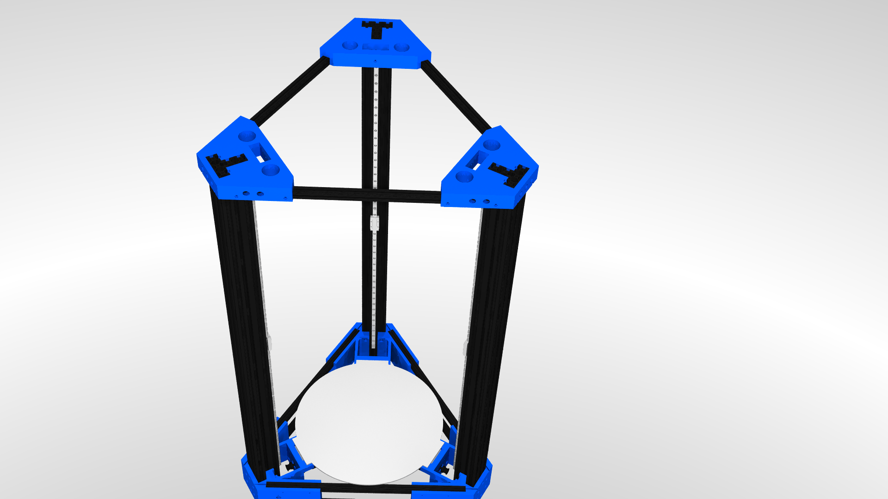

# Monster Kossel: v3.0

A Kossel-inspired Delta printer with:
* large build volume
* an incredibly stiff frame
* an easily fully enclosed build volume
* piezo-based bed probing (Andromeda layout from precisionpiezo.co.uk)
* easy to tune / upgrade setups
* M3 and M5 screws only

## Design history:

V1 started with my taking a Kossel XL idea but noticing the OpenBeam frames just weren't rigid enough. 
I tweaked the STL files with Blender to use 2040 towers instead. It was better... But still a bit wobbly.

V2 was still done with Blender but introduced the T-based towers using 2060 and 2040 extrusions for the maximum possible rigidity.
It also introduced the concept of the fully enclosed build volume. 

It became the test bed for a series of remote drive extruder designs by Dan Cook, which are proving to be incredibly reliable.
The latest iteration of which is a mix of extruder and effector design for Kossel sized rod widths. 
It's proven to handle flexibles as good as a Prusa MK3's stock extruder, if not better.

V3, shared here, is an ongoing effort to properly draw and design a revision of V2 in a proper CAD format.
The aim is to further enhance the experience by incorporating many lessons learned with regards to cable management.
It is currently being drawn and assembled in FreeCAD 0.19_pre release, using the Assembly4 plugin.

## Assembly file(s)

The main assembly file is `assembly_a2plus.FCStd`, made for the `A2Plus` plugin installed in `FreeCAD 0.19` or later, it will open all the other parts as needed from the folder.
The other workbench that is required is the `Fasteners` workbench, to include all the screws & nuts into the assemblies.

## Current development status

The main frame of V3 has not yet been tested in real life, and only exists as CAD files at present.

The V3 frame will be built soon, as the parts have been printed. Dan Cook has released his all in one effector / direct drive extruder on [Thingiverse](https://www.thingiverse.com/thing:4886240/files), including the telescoping shaft of my conception.

The telescopic shaft has been built, and is printing successfully on the Flex'Y v17 (not shared as not my design) with regular and flexible filament prints on the V2 frame.
A new revision of the Flex'Y that removes the worm drive is currently being developped to use printed bevel gears instead of a worm drive.

Carriages have been redrawn as the original Kossel carriages designed for the MGN19H carriage pattern don't have enough rigidity when using an adapter plate. 
All parts will be printed in PETG rather than PLA for heat resistance.

The top cover will come in two versions: one as a blank template for builders to customize the layout of elements on their own, the other as I intend to build it, using 100mm AC extraction ventilation systems with filters, mounting holes for the extruder motor, wire and filament paths.

### BOM

#### Printed parts:

Best rigidity achieved using PETG or similar material, with 1 or 1.2mm thick walls, and 20% infill, and 0.2 or 0.3 layer height.

- bottom corner: 3x (or bottom corner M3x10 x3, not both!)
- motor frame: 3x
- top corner: 3x
- carriage belt tensioner: 3x
- mgn9c carriage: 3x
- extruder parts (all are x1, printed with finer layer height is better):
  - 18T bevel
  - 6T bevel
  - Body top
  - Delta effector
  - Latch
  - Main body center
  - Main body left
  - Main body right

#### Non-printed parts:

- MGN9H rails: 3
- MGN9C carriages: 3
- NEMA17 motors: 4
- Traxxas 5347 spherical joints: 12
- carbon / aluminum rods: estimate 6x 390mm for a 350mm bed - identical lengths required
- E3D V6 hotend with M-12 threaded heatsink ([blue heatsink](https://e3d-online.com/products/v6-threaded-heatsink)): 1 (if enclosed, consider getting a [water-cooled, M12-mounting](https://www.thingiverse.com/thing:3088118/files) heatsink or hotend instead)
- Telescoping torque shaft:
 - aluminum square tubing 9mm on the side : length to be measured
 - aluminum square tubing 12mm on the side : length to be measured
 - aluminum square tubing 15mm on the side : length to be measured
 - double u-joints with 4mm shaft: 2
 - round 4mm steel rod: 2x 50mm
- [PrecisionPiezo Andromeda](https://www.precisionpiezo.co.uk/product-page/andromeda) : 3
- [PrecisionPiezo Universal Piezo Z-Probe PCB](https://www.precisionpiezo.co.uk/product-page/universal-piezo-z-probe-pcb-v2-x-for-1-2-3-or-more-piezos) : 1
- Endstops: 3 (optional if your electronics & firmware supports sensorless homing)
- Electrical wiring (red and black recommended in equal lengths): ~ 10m of each color recommended. Lots of variability depending on placements.
- GT2-6mm wide belt: 3 times twice the vertical extrusion length (for 1m tall, get 3 of 2m length, will give ~100mm of slack per tower)
- Control board: minimum of 4 stepper drivers + 2 heater controls (2 temperature inputs, 2 MOSFETs)
- PSU: Minimum of 650W if heatbed is not using AC and a relay
- M3 nuts: 69 (bottom assembly: 42, top frame: 12, motor frames: 9, idler centering: 6)
- M3 washers: 18 (motor frames: 18)
- socket cap M3x5: 15 (motor frames: 3, carriage assemblies: 12)
- socket cap M3x8: 69 (tower assemblies: 45, top frame: 12, motor frames: 12)
- socket cap M3x12: 24 (bottom frame: 24) - can be M3x10 if you print the M3x10 bottom corner parts instead.
- button cap M3x15 : 6 (motor frames: 6) - can also be longer, for bed assembly
- socket cap M3x16: 18 (bottom frame assembly: 18) - can also be M3x15
- countersunk head M3x20: 6 (bottom frame assembly: 6)
- socket cap M3x30: 3
- socket cap M5x8: 24 (top frame: 12, bottom frame: 12)
- socket cap M5x10: 9 (top frame: 9)
- socket cap M5x12: 18 (bottom frame: 18)
- socket cap M5 Openbuilds flat nuts: 51
- F623ZZ flanged bearings: 6 OR idler pulleys for GT2x6mm : 3
- Nema 17 motors (1.8 degree is fine, 1.2-1.5A capability sufficient): 4
- 16-teeth pulley for 5mm shaft (with M3x4 set screw): 3
- Acrylic sheet (3mm): 3x 900mm x 500mm (use dimensions of side_panel)
- Acrylic sheet (5mm): 450mm x 400mm (cut using top_cover template)
- Extruder parts:
  - M8x35 bolt: 1
  - MR 148ZZ bearings (8mm ID, 14mm OD, 4mm thick): 4
  - Bondtech [dual drive gears 1.75 / 8](https://www.bondtech.se/product/drivegear-kits/): 1 set
  - M3x12 hex socket cap
  - M4x40 set screw
  - M3x8 hex socket cap

## Credit

I want to thank [Dan Cook](https://www.thingiverse.com/dancook3d/designs) for his wonderful [bevel geared extruder design](https://www.thingiverse.com/thing:4886240/files). We've exchanged a fair bit before he published it, and I'm happy to see that project being this successful on its own.
Additionally he made a [great delta carriage](https://www.thingiverse.com/thing:3070352) which I'm using in the Monster Kossel design.
Both of those designs you'll find the relevant step files in the `STEP` subfolder.
